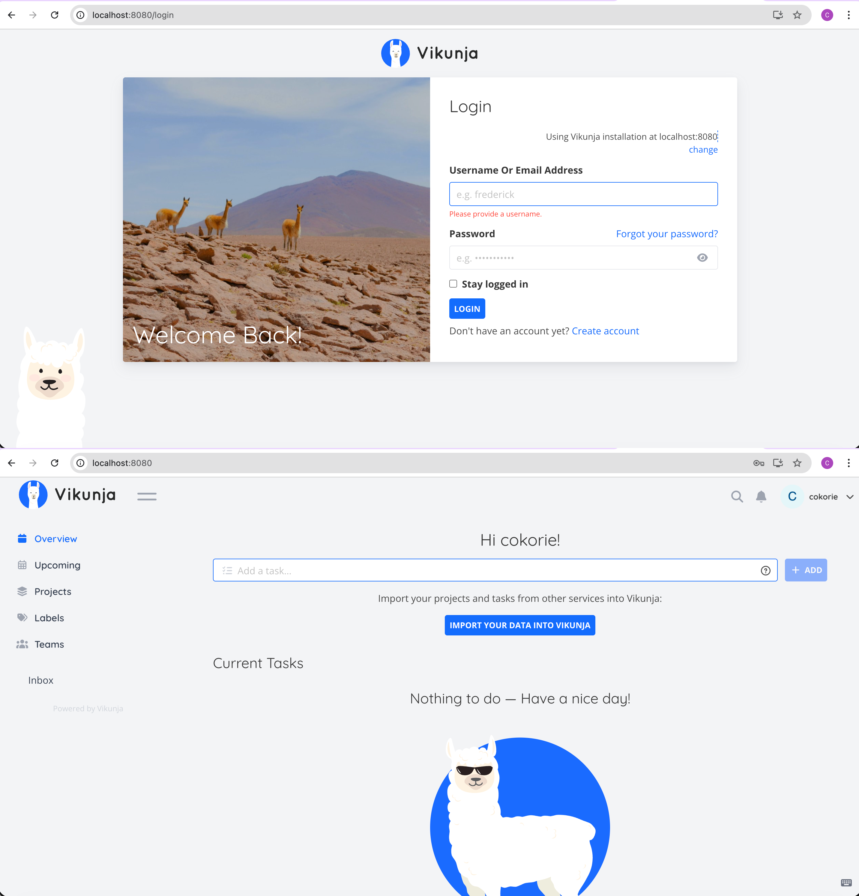
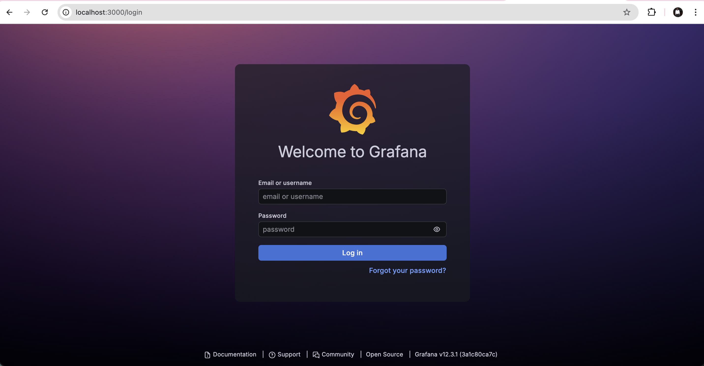

# Vikunja Kubernetes Deployment (Minikube)

## Get Started with Your Production-Ready ToDo Application
Unleash the power of Kubernetes for your Vikunja ToDo application! This guide provides detailed step-by-step instructions for local development on minikube and a comprehensive production deployment guide for Google Cloud Platform (GCP). Experience seamless task management with a fully containerized, cloud-native architecture that scales with your needs.

**Key Features:**
- **Production-Ready Architecture**: Complete Kubernetes deployment with StatefulSet database, HPA scaling, and ingress routing
- **Persistent Data Storage**: PostgreSQL StatefulSet ensures your tasks survive pod restarts and scaling events
- **Auto-Scaling**: Horizontal Pod Autoscaler automatically adjusts replicas based on CPU utilization
- **Health Monitoring**: Built-in liveness and readiness probes ensure application reliability
- **Optional Observability**: Full Prometheus and Grafana monitoring stack for production insights
- **Local Development**: Easy minikube setup for testing and development workflows

## Overview
This project demonstrates a Kubernetes deployment of the Vikunja ToDo application using Helm. The setup below is designed for **local development and testing** using minikube.

**For production deployment on Google Cloud Platform (GCP)**, see [PRODUCTION_GUIDE.md](PRODUCTION_GUIDE.md) which includes production-ready modifications such as:
- Google Kubernetes Engine (GKE) cluster setup
- Cloud SQL for PostgreSQL
- Google Cloud Load Balancer
- SSL/TLS certificates
- Resource optimization and security hardening

## Architecture
- Vikunja API (Deployment + HPA)
- PostgreSQL (StatefulSet)
- Ingress for traffic routing
- ConfigMaps & Secrets
- Resource limits & probes
- Prometheus & Grafana monitoring (optional)

## Prerequisites
- **Git** version control system (https://git-scm.com/)
- **Docker** for containerization (https://www.docker.com/)
- **Minikube** for local Kubernetes cluster (https://minikube.sigs.k8s.io/)
- **Helm** package manager for Kubernetes (https://helm.sh/)
- **kubectl** Kubernetes command-line tool

## Why Helm?
This project uses **Helm** as the deployment templating tool for several key reasons:

- **Template Reusability**: Helm charts allow parameterized deployments across different environments (dev, staging, prod) using values files
- **Dependency Management**: Built-in support for managing complex application dependencies and sub-charts
- **Release Management**: Helm tracks deployment history, enabling easy rollbacks and upgrades
- **Community Ecosystem**: Extensive library of pre-built charts and strong community support
- **Configuration Management**: Clean separation of application logic (templates) from environment-specific configuration (values)
- **Kubernetes Native**: Designed specifically for Kubernetes, understanding resource relationships and deployment patterns

Compared to alternatives:
- **vs Kustomize**: Helm provides better templating capabilities and release management
- **vs Jsonnet**: Helm has better Kubernetes integration and simpler learning curve
- **vs Plain YAML**: Helm eliminates configuration duplication and enables environment-specific deployments

## Setup

### 1. Start Minikube
```bash
# Start minikube with sufficient resources
minikube start --memory=4096 --cpus=2

# Verify minikube is running
minikube status
```

### 2. Enable Required Addons
```bash
# Enable ingress controller
minikube addons enable ingress

# Enable metrics server (for kubectl top and HPA)
minikube addons enable metrics-server

# Verify addons are enabled
minikube addons list | grep -E "ingress|metrics-server"
```

### 3. Deploy Vikunja Application
```bash
# Install Vikunja using Helm
helm install vikunja ./helm/vikunja

# Wait for pods to be ready
kubectl wait --for=condition=ready pod -l app=vikunja --timeout=300s
kubectl wait --for=condition=ready pod -l app=postgres --timeout=300s

# Check deployment status
kubectl get pods,svc,ingress
```

### 4. Access Vikunja Application
```bash
# Get the application URL
minikube service vikunja --url

# Alternative: Port forward to access via localhost
kubectl port-forward svc/vikunja 8080:80

# Open in browser: http://localhost:8080
```

**Expected Result**: You should see the Vikunja ToDo application interface where you can create projects, add tasks, and manage your todo lists.

## Optional: Add Monitoring (Prometheus + Grafana)

### 1. Add Helm Repository
```bash
# Add Prometheus community repo
helm repo add prometheus-community https://prometheus-community.github.io/helm-charts
helm repo update
```

### 2. Install Monitoring Stack
```bash
# Install monitoring stack
helm install monitoring prometheus-community/kube-prometheus-stack \
  --create-namespace --namespace monitoring

# Wait for monitoring pods to be ready
kubectl wait --for=condition=ready pod -l app.kubernetes.io/name=grafana -n monitoring --timeout=300s
kubectl wait --for=condition=ready pod -l app.kubernetes.io/name=prometheus -n monitoring --timeout=300s
```

### 3. Access Monitoring Services
```bash
# Access Grafana (admin/prom-operator)
kubectl port-forward -n monitoring svc/monitoring-grafana 3000:80

# Access Prometheus (in another terminal)
kubectl port-forward -n monitoring svc/monitoring-kube-prometheus-prometheus 9090:9090
```

## Access Applications
- **Vikunja**: `minikube service vikunja --url` or `http://localhost:8080` (if using port-forward)
- **Grafana**: `http://localhost:3000` (admin/prom-operator)
- **Prometheus**: `http://localhost:9090`

## Screenshots
For visual confirmation of successful deployment:


*Vikunja ToDo application interface showing project and task management*


*Prometheus metrics dashboard monitoring application performance*


*Grafana monitoring dashboard with Kubernetes cluster metrics*

## Verification Commands
```bash
# Check all pods are running
kubectl get pods --all-namespaces

# Check resource usage (requires metrics-server)
kubectl top pods

# Run troubleshooting script
./monitoring/troubleshooting.sh
```
